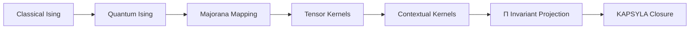

# SIGIL_JUNIOR_ISING_KERNELS_V1

## Scope

Teaching repository for SIGIL junior developers using:

- classical Ising model
- quantum Ising model in 1D
- Majorana fermion mapping
- translation invariant 2D Ising systems
- Onsager transition funktor
- compositional contextual kernels

---

## Core pedagogy

```text
everything begins with Ising
```

and evolves through:

```text
spin
→ parity
→ transfer
→ fermionization
→ tensorization
→ contextual kernels
→ invariant projection Π
```

---

## Teaching ladder

```yaml
SIGIL_JUNIOR_CURRICULUM:

  phase_0:
    topic: classical_ising_1D
    concepts:
      - spins
      - nearest_neighbor_coupling
      - partition_function
      - transfer_matrix

  phase_1:
    topic: classical_ising_2D
    concepts:
      - translation_invariance
      - Onsager_solution
      - criticality
      - renormalization

  phase_2:
    topic: quantum_ising_1D
    concepts:
      - transverse_field
      - Jordan_Wigner
      - Majorana_fermions
      - parity_sectors

  phase_3:
    topic: tensor_networks
    concepts:
      - MPS
      - PEPS
      - DMRG
      - QTT
      - DMRGΠ

  phase_4:
    topic: compositional_contextual_kernels
    concepts:
      - SIGIL
      - UAP
      - Φ
      - Π
      - KAPSYLA
      - contextuality
```

---

## Quantum Ising mapping

```text
Quantum Ising chain
→ Jordan-Wigner
→ Majorana fermions
→ quadratic kernel
→ invariant parity sectors
```

---

## Onsager transition funktor

```text
2D translation invariant Ising
→ transfer structure
→ critical transition
→ renormalized invariant sector
```

Interpretation:

```text
Onsager funktor = contextual transition operator
preserving invariant thermodynamic structure
```

---

## SIGIL mapping



---

## Runtime law

```text
Classical locality
→ quantum parity
→ compositional contextuality
→ invariant replay-safe kernels
```

---

## Compression

```text
Ising teaches locality.
Majoranas teach parity.
Onsager teaches transition.
SIGIL teaches admissibility.
Π teaches identity.
```

---

## Final law

```text
Junior developers learn contextual kernels
through executable Ising dynamics.
```

**KANONIKAL. SIGIL JUNIOR ISING KERNELS SEALED.**
